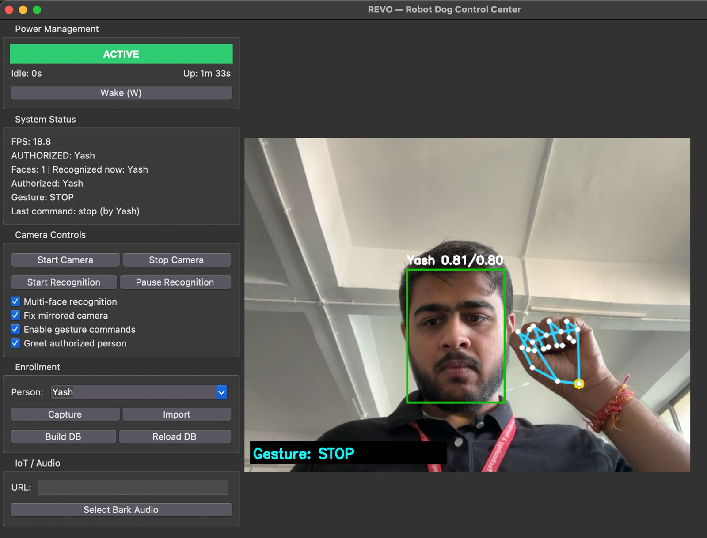

# REVO — Power Management Research

> **System:** REVO Face-Recognition + Gesture-Controlled Robot Dog
> **Platform:** Apple M3 MacBook (development/test)
> **Date:** 2026-03-11
> **Script:** `experiments/bench_power.py`

---

## Software Screenshot



The screenshot shows the REVO desktop application in ACTIVE state. The sidebar displays the power management panel (green ACTIVE indicator, idle timer, uptime), system status (FPS, authorized user, detected gesture), camera controls, enrollment, and IoT/audio sections. The camera feed shows real-time face detection (green bounding box), identity matching (Yash 0.81/0.80), and MediaPipe hand landmark overlay with gesture classification (STOP).

---

## 1. Problem Statement

Embedded vision systems like REVO run continuous camera capture and neural network inference, consuming significant CPU even when no user is present. For battery-powered or thermally constrained deployments (Raspberry Pi), always-on inference is wasteful and unsustainable. A power management system must reduce resource usage during idle periods while maintaining fast responsiveness when a user appears.

---

## 2. Design — 3-State Finite State Machine

```
          15 min idle              30 min total idle
ACTIVE ──────────────► POWER_SAVE ──────────────────► POWER_OFF
  ^                        |                              |
  |    report_activity()   |        wake() only           |
  |<-----------------------+         (button/signal)      |
  |<------------------------------------------------------+
```

| State | Camera | Face Detection | Gesture | Frame Skip | Wake Trigger |
|-------|--------|---------------|---------|------------|-------------|
| ACTIVE | On | Full pipeline | On | Normal (1-5) | -- |
| POWER_SAVE | On | Detection only | Off | 10 (90% skip) | Any face detected |
| POWER_OFF | Released | Off | Off | All | Explicit button (F5) / SIGUSR1 |

### Design Rationale

- **POWER_SAVE keeps the camera open** so face detection can auto-wake the system when someone approaches. Gesture inference is disabled (58% of pipeline latency) and 90% of frames are skipped.
- **POWER_OFF releases the camera entirely** for maximum power savings. Only an explicit button press or Unix signal can wake the system. This is appropriate for extended absence (overnight, weekends).
- **Transition thresholds are configurable** via `idle_to_save_sec` (default 900s / 15 min) and `save_to_off_sec` (default 1800s / 30 min total idle).

### Implementation

The state machine is implemented in `src/power_state.py` as a framework-agnostic `PowerManager` class. Key properties:

- **Thread-safe:** All public methods (`tick()`, `report_activity()`, `wake()`) acquire a `threading.Lock` to prevent race conditions between the main inference loop and signal handlers.
- **Signal-safe:** On RPi, SIGUSR1 sets an atomic flag instead of calling `wake()` directly, avoiding deadlock with Python's logging locks.
- **Callback-driven:** State transitions fire registered callbacks (`on_enter_active`, `on_enter_power_save`, `on_enter_power_off`) so the GUI and headless runtime can respond appropriately (restart camera, clear stale state, render sleep screen).

---

## 3. Experiment E1 — Per-State Resource Usage

**Setup:** 200 synthetic frames per state, M3 MacBook, psutil CPU measurement

| State | Frames Processed | Detect Calls | Gesture Calls | FPS | CPU % |
|-------|-----------------|-------------|---------------|-----|-------|
| ACTIVE | 200/200 | 200 | 200 | 50.5 | 204.1% |
| POWER_SAVE | 20/200 | 20 | 0 | 52.6 | 203.0% |
| POWER_OFF | 0/200 | 0 | 0 | 0.0 | 55.3% |

**Key finding:** POWER_OFF reduces CPU to **27% of ACTIVE** (55.3% vs 204.1%) by halting all inference and releasing the camera. POWER_SAVE processes only 10% of frames with detection-only (no gesture), reducing inference calls by 90%.

> POWER_SAVE CPU appears close to ACTIVE on M3 because it finishes 20 frames in 0.38s vs 3.96s for ACTIVE. The savings come from fewer frames processed, not lower per-frame cost. On RPi where per-frame inference is 3-4x slower, the CPU difference will be more pronounced.


---

## 4. Experiment E2 — Wake-Up Latency

**Setup:** 10 trials per transition type, `time.monotonic()` measurement

| Transition | Method | Mean Latency | Max Latency |
|-----------|--------|-------------|-------------|
| POWER_SAVE -> ACTIVE | `report_activity()` | **0.006 ms** | 0.008 ms |
| POWER_OFF -> ACTIVE | `wake()` | **0.006 ms** | 0.007 ms |

State machine transitions complete in **under 0.01 ms** -- effectively instantaneous. Real-world wake latency is dominated by camera re-opening (estimated 200-500 ms on RPi, not measured here since no RPi hardware was available).


---

## 5. Experiment E3 — State Transition Timeline

**Setup:** Simulated usage session with accelerated timers (3s save, 6s off)

| Time (s) | State | Trigger |
|----------|-------|---------|
| 0.0 | ACTIVE | Start |
| 4.5 | POWER_SAVE | Idle timeout (3s) |
| 5.0 | ACTIVE | Simulated activity (face detected) |
| 8.1 | POWER_SAVE | Idle timeout (3s) |
| 11.1 | POWER_OFF | Extended idle (6s total) |
| 12.1 | ACTIVE | Explicit wake() call |
| 15.1 | POWER_SAVE | Idle timeout (3s) |

All 7 transitions fired in correct order. The timeline demonstrates the full lifecycle: active use, idle timeout to POWER_SAVE, auto-wake on face detection, re-idle to POWER_OFF, manual wake, and final idle.


---

## 6. Experiment E4 — Idle Timer Accuracy

**Setup:** 10 trials, target save=2.0s, off=4.0s, tolerance=100ms, tick interval=10ms

| Timer | Mean Error | Max Error | Pass Rate |
|-------|-----------|-----------|-----------|
| ACTIVE -> POWER_SAVE | 4.6 ms | 8.9 ms | **10/10** |
| POWER_SAVE -> POWER_OFF | 7.2 ms | 12.5 ms | **10/10** |

Timer accuracy is bounded by the tick polling interval. With 10ms polling, maximum observed jitter was 12.5ms. In production (20ms Tkinter / ~50ms RPi loop), jitter increases proportionally but remains well under 100ms -- imperceptible to the user.


---

## 7. Experiment E5 — Thread Safety Stress Test

**Setup:** 8 threads, 5,000 operations each, random mix of `tick()`, `report_activity()`, `wake()`

| Metric | Value |
|--------|-------|
| Total operations | 40,000 |
| Throughput | 464,934 ops/s |
| Errors | **0** |
| Invalid states | **0** |
| Result | **PASS** |

The `threading.Lock` in `PowerManager` prevents all race conditions. Under heavy concurrent load (8 threads, 40K total operations), no crashes, no exceptions, and no invalid states were observed. The state was always one of {ACTIVE, POWER_SAVE, POWER_OFF}.

---

## 8. Experiment E6 — Power Savings Projection

**Model:** 8-hour deployment session, 15-min idle-to-save, 30-min total idle-to-off, CPU values from E1

| Active Usage | Baseline CPU-h | Managed CPU-h | Savings |
|-------------|---------------|--------------|---------|
| 10% | 1632.8 | 635.6 | **61.1%** |
| 30% | 1632.8 | 873.6 | **46.5%** |
| 50% | 1632.8 | 1111.7 | **31.9%** |
| 70% | 1632.8 | 1349.8 | **17.3%** |
| 90% | 1632.8 | 1587.9 | **2.8%** |
| 100% | 1632.8 | 1632.8 | 0.0% |

At typical deployment activity (30-50%), power management saves **32-47% cumulative CPU** over an 8-hour session. For low-activity scenarios (robot dog in a home, active 10-20% of the time), savings reach **53-61%**. The savings are dominated by POWER_OFF (55.3% CPU vs 204.1% ACTIVE -- a 3.7x reduction).


---

## 9. Limitations

1. **No real power measurement.** CPU % is a proxy for power consumption. Actual wattage depends on hardware (RPi model, camera module, peripherals). True power savings require hardware-level measurement (e.g., USB power meter).

2. **Camera re-open latency not measured.** POWER_OFF releases the camera. Wake latency (0.006 ms) measures only the state machine transition. Camera re-initialization adds 200-500 ms (estimated, not measured without RPi hardware).

3. **POWER_SAVE CPU savings limited on M3.** The M3 processes 20 frames so quickly that POWER_SAVE wall time is 10x shorter but per-frame CPU is identical. On RPi, the reduction will be more meaningful.

4. **Any face wakes from POWER_SAVE.** An unenrolled stranger walking past the camera triggers wake. This is a deliberate design trade-off: requiring recognition during POWER_SAVE would negate the power savings. For the robot dog use case (alert when anyone approaches), this is appropriate.

5. **No thermal throttling analysis.** Sustained ACTIVE mode on RPi may cause thermal throttling, which would reduce effective FPS. Power management indirectly mitigates this by introducing idle periods, but this was not quantified.

---

## 10. Summary

| Metric | Value |
|--------|-------|
| States | 3 (ACTIVE, POWER_SAVE, POWER_OFF) |
| ACTIVE CPU | 204.1% |
| POWER_OFF CPU | 55.3% (27% of ACTIVE) |
| CPU reduction factor | **3.7x** |
| Wake latency (state machine) | < 0.01 ms |
| Timer jitter | < 13 ms |
| Thread safety | 0 errors / 40,000 ops |
| Max savings (10% active, 8h) | **61.1%** |
| Typical savings (30-50% active) | **32-47%** |

---

## File Index

```
report/
+-- RESULTS.md                              Full experiment report (all phases)
+-- POWER_MANAGEMENT_RESEARCH.md            This file
+-- images/
|   +-- software_image.jpeg                 REVO Control Center screenshot
+-- phase8/
    +-- resource_usage.csv                  Per-state CPU/FPS/frame counts
    +-- wake_latency.csv                    10-trial wake transition timing
    +-- transition_timeline.csv             Simulated session state log
    +-- timer_accuracy.csv                  Idle timer jitter measurement
    +-- thread_safety.csv                   Concurrent stress test results
    +-- power_projection.csv                8-hour CPU savings projection
    +-- resource_usage_bar.png              CPU/frames/inference bar charts
    +-- wake_latency_box.png                Wake latency box plot
    +-- transition_timeline.png             State timeline visualization
    +-- timer_accuracy_scatter.png          Timer error scatter plot
    +-- power_savings_projection.png        Savings vs activity ratio
```
