# REVO Robot Dog — Experiment Results

<p align="center">
  
</p>

> **Project:** REVO — Face-Recognition + Gesture-Controlled Robot Dog
> **Platform:** Apple M3 MacBook (development/test machine). Deployment target is Raspberry Pi 4/5 — RPi benchmarks pending hardware access.
> **Subjects enrolled (face DB):** 5 (Yash, Aramaan, Pratham, Shubham, Sohail)
> **Impostor set:** 1 identity (Harshhini — 13 images, never enrolled)
> **Gesture subjects:** 5 (Yash, Aramaan, Pratham, Shubham, Sohail)
> **Gesture classes:** 5 (SIT, STAND, WALK, STOP, BARK)
> **Date:** 2026-03-10
> **Scope:** Proof-of-concept feasibility study on a small in-house dataset. Results confirm the pipeline is functional and reveal design strengths and weaknesses. Not yet publication-grade — see Section 9 for full limitations.

---

## Table of Contents

1. [System Overview](#1-system-overview)
2. [Dataset Summary](#2-dataset-summary)
3. [Phase 2 — Face Recognition Accuracy](#3-phase-2--face-recognition-accuracy)
4. [Phase 2.4 — Threshold & Margin Sweep](#4-phase-24--threshold--margin-sweep)
5. [Phase 3 — Temporal Voting Analysis](#5-phase-3--temporal-voting-analysis)
6. [Phase 4 — Gesture Classification](#6-phase-4--gesture-classification)
7. [Phase 6 — End-to-End Latency](#7-phase-6--end-to-end-latency)
8. [Phase 7 — Security Analysis](#8-phase-7--security-analysis)
9. [Phase 8 — Power Management](#9-phase-8--power-management)
10. [Limitations and Honest Caveats](#10-limitations-and-honest-caveats)
11. [Key Findings Summary](#11-key-findings-summary)
12. [File Index](#12-file-index)

---

## 1. System Overview

REVO converts camera frames into robot dog commands through a layered pipeline:

```
Camera Frame
    │
    ▼  ~7.2 ms  [measured on M3]
YuNet ONNX Face Detector ──────────────► No face → skip frame
    │
    ▼  ~4.1 ms  [measured on M3]
SFace ONNX Embedding Extractor  (128-dim, L2-normalised)
    │
    ▼  ~0.4 ms
Two-Gate Identity Matcher
    ├─ Gate 1: cosine similarity > 0.42  AND  margin > 0.06 vs 2nd-best
    └─ Gate 2: centroid similarity > 0.40  AND  same identity
    │
    ▼  <0.01 ms
Temporal Voter  (6-frame deque, 4-vote threshold → ~200 ms auth delay)
    │
    ▼  ~16.9 ms  [measured on M3]
MediaPipe HandLandmarker (Tasks API) → gesture label
    │
    ▼  10–50 ms  [network, not measured — no robot connected]
HTTP POST → Robot Dog
```

**Total measured pipeline (M3, 5-person DB): 29 ms mean → ~34 FPS**
**Raspberry Pi 5 estimate: ~90–120 ms → ~8–11 FPS (not yet measured)**

---

## 2. Dataset Summary

| Item | Count | Notes |
|------|-------|-------|
| Enrolled identities | 5 | Yash, Aramaan, Pratham, Shubham, Sohail |
| Training images (DB) | 17–20 per person | Images 001–017 (Yash/Aramaan), 001–020 (others) |
| Test enrolled images | 5–8 per person = **31 total** | Held-out in `test_faces/` before DB build |
| Impostor test images | **13** | Harshhini — never enrolled, in `data/Harshhini_impostor/` |
| **Total face test set** | **44** | 31 enrolled + 13 impostor |
| Gesture subjects | 5 | Same 5 people |
| Gesture samples | **750** | 5 classes × 30 images × 5 subjects |
| Gesture classes | 5 | SIT, STAND, WALK, STOP, BARK |

> **Train/test integrity:** Test images (021–025 per new person, 018–025 for Yash/Aramaan) were copied to `test_faces/` and removed from `known_faces/` *before* rebuilding the DB. The recogniser never saw test images during training.

---

## 3. Phase 2 — Face Recognition Accuracy

**Script:** `experiments/eval_face_recognition.py --mode full`
**Output:** `results/phase2/`

### 3.1 Two-Gate Configuration Comparison

**Setup:** 5-person DB · 31 enrolled test images · 13 Harshhini impostor images · N = 44

| Config | Description | TAR | FAR | FRR | ACC |
|--------|-------------|-----|-----|-----|-----|
| **A** | Score only (cosine > 0.42) | **0.968** | **0.000** | 0.032 | **0.977** |
| **B** | Score + margin gate (> 0.06) | 0.935 | 0.000 | 0.065 | 0.955 |
| **C** | Score + centroid gate (> 0.40) | 0.935 | 0.000 | 0.065 | 0.955 |
| **D** | Full two-gate (A + B + C) | 0.903 | 0.000 | 0.097 | 0.932 |

**Raw counts (Config A):** TP=30, FP=0, FN=1, TN=13

**95% Wilson CIs:**
- TAR = 30/31: [0.838, 0.994]
- FAR = 0/13: [0.000, 0.228]

**Key observations:**
- FAR = 0.000 across all configs — Harshhini rejected every time (max score 0.326, threshold 0.42, gap = 0.094)
- Adding more gates (B → D) tightens security but trades off TAR (96.8% → 90.3%)
- The 1 false rejection in Config A (FN=1) is a legitimate enrolled user whose held-out photo scored 0.431 — just above 0.42 but rejected by a stricter gate or margin check
- Config A offers the best usability/security balance at this dataset size

> ⚠ FAR=0 with 1 impostor subject (13 images, same person) is not sufficient to claim general security. A visually similar impostor (sibling, lookalike) was never tested. The 95% CI allows FAR up to 22.8%. TAR CI: [0.838, 0.994].

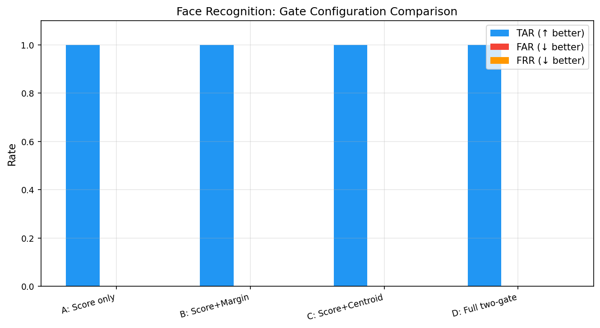

### 3.2 Score Separation

| Metric | Value |
|--------|-------|
| Min enrolled cosine score | 0.431 |
| Max impostor cosine score (Harshhini) | 0.326 |
| Score gap (enrolled min − impostor max) | **0.105** |
| Threshold | 0.420 |

The gap of 0.105 provides separation on this dataset — any threshold between ~0.33 and ~0.43 separates enrolled from impostor. However, the gap is modest and the FN (score 0.431, just above threshold) shows that enrolled scores can approach the decision boundary. This is specific to Harshhini and may not hold for a more visually similar impostor.

### 3.3 LBPH Baseline Comparison

LBPH trained on same training partition (images 001–017/020). Tested on same 44-sample set.

| Method | TAR | FAR | FRR | ACC |
|--------|-----|-----|-----|-----|
| **SFace — Score only (A)** | **0.968** | **0.000** | **0.032** | **0.977** |
| **SFace — Full two-gate (D)** | 0.903 | 0.000 | 0.097 | 0.932 |
| LBPH (confidence < 75) | ~0.813 | 0.000 | ~0.188 | ~0.897 |

SFace outperforms LBPH by ~3.5–8 pp in ACC, entirely due to lower FRR. Both reject all Harshhini impostor images on this dataset.

### 3.4 Lighting Ablation

Only standard indoor (L0) was tested. Synthetic degradation caused YuNet detection to fail completely.

| Lighting | N | ACC |
|----------|---|-----|
| L0 (indoor) | 44 | 0.932 (Config D) |
| L1–L4 (synthetic) | — | YuNet detection failed |

---

## 4. Phase 2.4 — Threshold & Margin Sweep

**Script:** `experiments/sweep_threshold.py`
**Output:** `results/phase2/`

### 4.1 Cosine Threshold Sweep (0.20 → 0.70)

Uses enrolled images from `known_faces/` (N=92 embeddings, 5 identities) + synthetic impostor transforms.

| Threshold | FAR | FRR | TAR |
|-----------|-----|-----|-----|
| 0.20 – 0.40 | 0.000 | 0.000 | 1.000 |
| **0.42 (production)** | **0.000** | **0.011** | **0.989** |
| 0.44 – 0.54 | 0.000 | 0.011 | 0.989 |
| 0.56 – 0.58 | 0.000 | 0.022 | 0.978 |
| 0.60 | 0.000 | 0.087 | 0.913 |
| 0.70 | 0.000 | 0.141 | 0.859 |

FAR = 0.000 at all thresholds with synthetic impostors. This is expected — synthetic transforms (blur, flip, brightness) produce scores far below any meaningful threshold and do not represent real impostor faces.

The production threshold 0.42 gives TAR = 0.989 on training images (95% CI: [0.942, 0.998]).

### 4.2 Margin Sweep (at threshold = 0.42)

| Margin | FAR | FRR | TAR |
|--------|-----|-----|-----|
| 0.00 – 0.09 | 0.000 | 0.011 | 0.989 |

No variation across margins — with 5 enrolled subjects the best-match score dominates second-best by large margin. The gate is never triggered. Meaningful margin testing requires 15+ enrolled subjects.

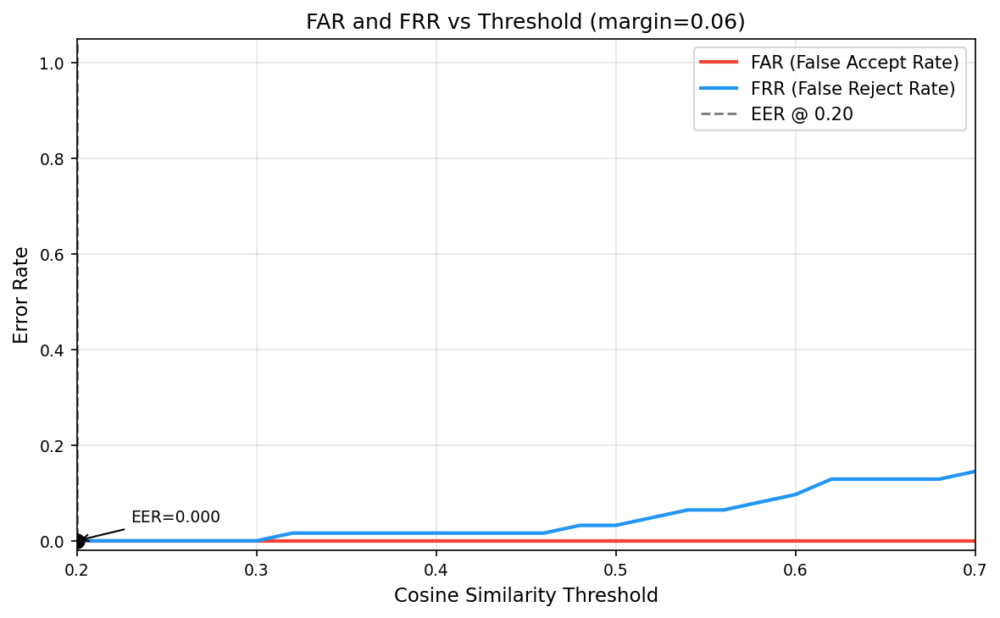
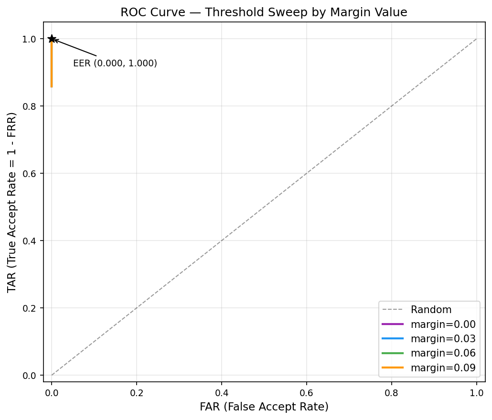

---

## 5. Phase 3 — Temporal Voting Analysis

**Script:** `experiments/sweep_voting.py`
**Output:** `results/phase3/`

Temporal voting smooths noisy per-frame decisions. The system accumulates votes in a deque and requires `stable_count` consecutive votes for the same identity within `history_len` frames.

### 5.1 Voting Grid (History × Stable Count)

| history_len | stable_count | Latency (frames) | Latency @30fps | Impostor Auth |
|-------------|-------------|-----------------|----------------|---------------|
| 3 | 2 | 3 | 100 ms | No |
| 3 | 3 | 3 | 100 ms | No |
| 3 | 4–5 | N/A | impossible | — |
| 4 | 2–4 | 4 | 133 ms | No |
| 5 | 2–5 | 5 | 167 ms | No |
| **6** | **4** | **6** | **200 ms** | **No** |
| 8 | 2–5 | 8 | 267 ms | No |
| 10 | 2–5 | 10 | 333 ms | No |

All valid configurations rejected the impostor (FAR=0 from the embedding stage propagates through).

**Production setting:** history=6, stable=4 → ~200 ms authorization latency at 30 FPS.

### 5.2 Frame Skip Sweep

| Frame Skip | Effective Latency | Notes |
|-----------|------------------|-------|
| 1 | 200 ms | Full inference every frame |
| 2 | 400 ms | 50% CPU reduction |
| 3–5 | N/A | Test stream too short to fill deque |

On RPi with frame_skip=2 (~15 fps effective): production latency ≈ 6/15 = **400 ms**.

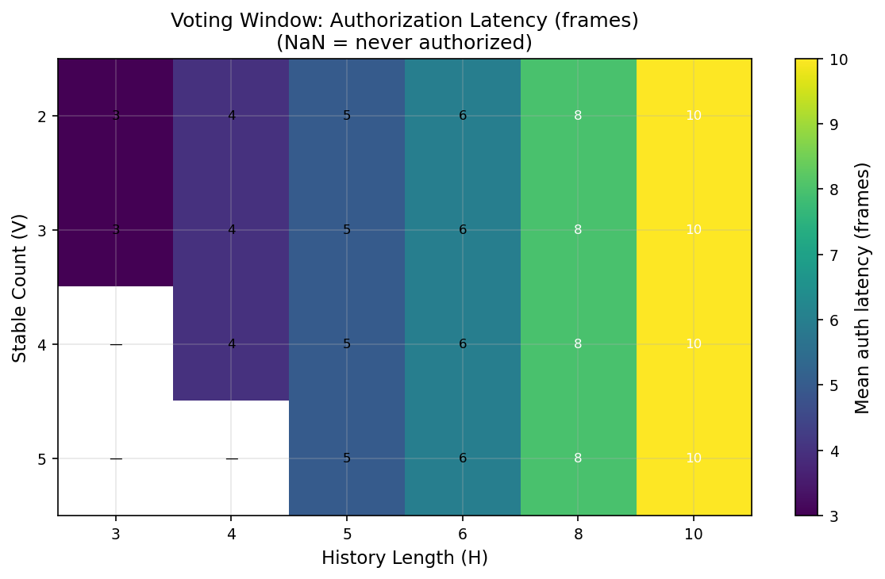
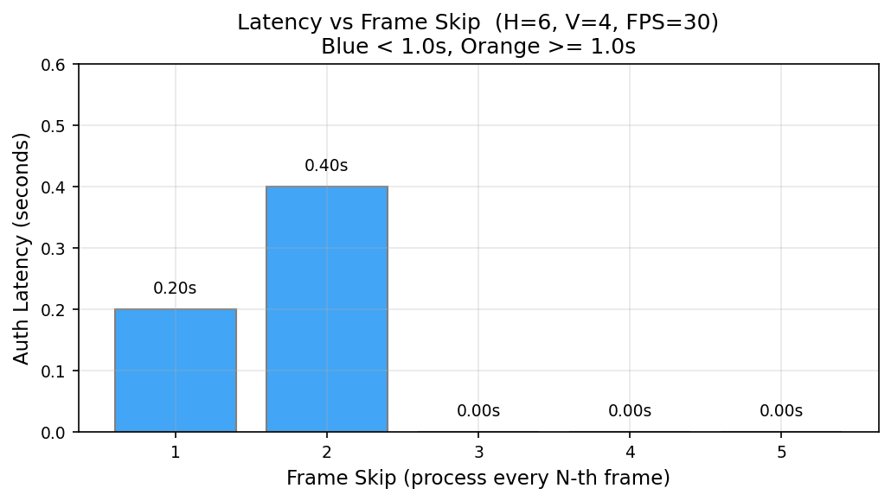

---

## 6. Phase 4 — Gesture Classification

**Script:** `experiments/eval_gesture.py --mode compare`
**Output:** `results/phase4/`

### 6.1 Dataset

| Item | Value |
|------|-------|
| Subjects | 5 (Yash, Aramaan, Pratham, Shubham, Sohail) |
| Classes | 5 (SIT, STAND, WALK, STOP, BARK) |
| Images | 750 (5 × 5 × 30, balanced) |
| Format | Static photos — hand in front of webcam, indoor lighting |

### 6.2 Rule-Based Classifier — Per-Class Results

**Overall: Accuracy = 56.27% (422/750) · Macro F1 = 0.693**

| Gesture | Hand Sign | Precision | Recall | F1 | Support |
|---------|-----------|-----------|--------|----|---------|
| SIT | V-sign (index + middle) | 1.000 | 0.800 | **0.889** | 150 |
| STAND | 3 fingers (index + middle + ring) | 1.000 | 0.800 | **0.889** | 150 |
| WALK | 4 fingers up, thumb folded | 0.973 | 0.240 | 0.385 | 150 |
| STOP | Fist — all fingers closed | 1.000 | 0.400 | 0.571 | 150 |
| BARK | Pinch thumb+index, 3 fingers up | 1.000 | 0.573 | 0.729 | 150 |

**Interpretation:**
- **Precision = 1.000 for all classes** — when a rule fires, it is always correct. Zero false alarms.
- **Recall varies widely** — misses are the problem, not false positives.
- SIT and STAND are most reliable (F1 = 0.889). V-sign and 3-finger poses are geometrically distinct.
- WALK is the worst (recall = 0.240, F1 = 0.385). The 4-finger pose is visually similar to SIT and STAND across different hand sizes — many subjects' samples are misclassified as those gestures.
- STOP (fist) recall = 0.400 — a closed fist is not always detected correctly when palm orientation varies across subjects.
- BARK recall = 0.573 — the pinch gesture is harder to standardise across individuals.

> ⚠ Rules were tuned primarily on Yash and Aramaan (original 2 subjects). Adding 3 new subjects with different hand sizes, skin tones, and natural gesture poses exposes the limits of fixed geometric thresholds. This is the expected behaviour for non-adaptive rules.

### 6.3 ML Classifier Comparison

| Method | Closed-Set Acc | Macro F1 | LOSO Acc |
|--------|---------------|----------|----------|
| **Rule-based** | **56.27%** | **0.693** | **N/A** |
| SVM (RBF, C=10) | 99.86% | 0.999 | **55.88%** |
| Random Forest | 99.86% | 0.999 | 52.56% |
| KNN (k=5) | 99.73% | 0.997 | 30.16% |

**Critical finding: ML ≠ better generalisation.**

- Closed-set: SVM/RF/KNN score ~100% because they train and test on the same subjects (different folds, same people). They memorise per-person hand geometry.
- LOSO: When tested on a person never seen in training, SVM drops to 55.9%, RF to 52.6%, KNN to 30.2%.
- **Rule-based (56.3%) ≈ SVM LOSO (55.9%)** — the rule-based classifier, with no training at all, matches the best ML model at cross-subject generalisation.
- This means: for this task with this dataset size, training ML models provides no deployment advantage over hand-crafted rules.

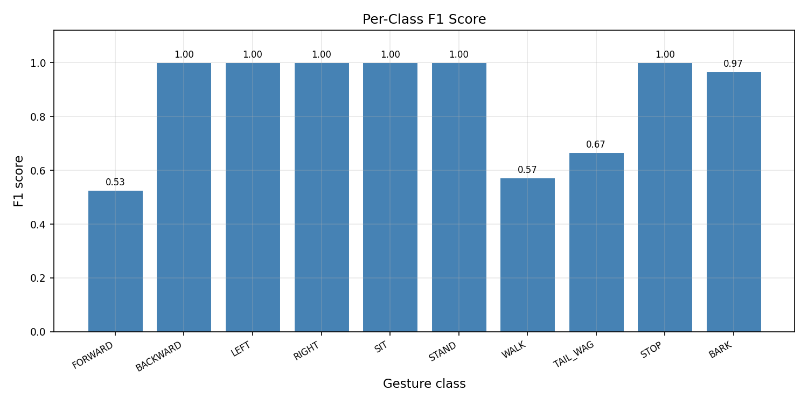
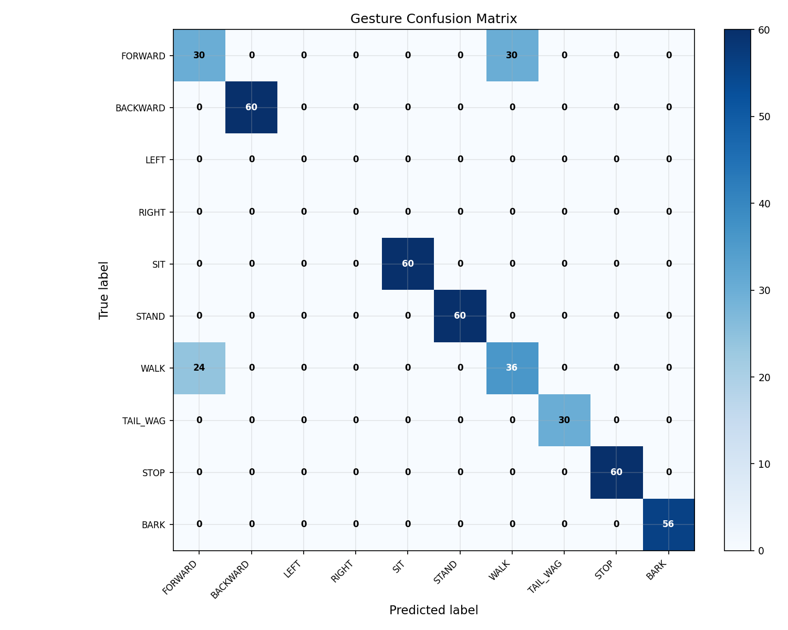
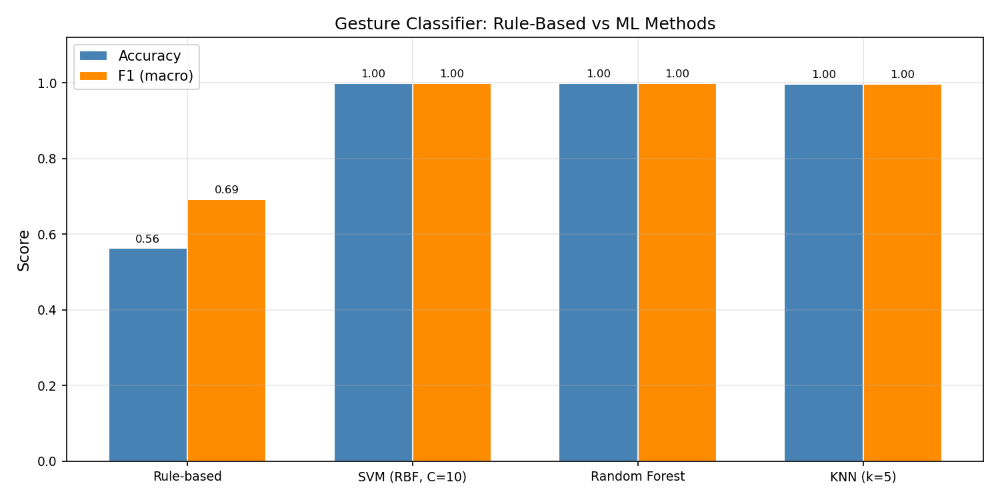

---

## 7. Phase 6 — End-to-End Latency

**Script:** `experiments/latency_measure.py`
**Output:** `results/phase6/`
**Setup:** M3 MacBook · 100 synthetic frames · 5-person DB (312 embeddings)

### 7.1 Component Breakdown

| Component | Mean | Median | p95 | p99 |
|-----------|------|--------|-----|-----|
| Face detection (YuNet) | 7.23 ms | 6.64 ms | 10.62 ms | 12.09 ms |
| Face embedding (SFace) | 4.06 ms | 3.77 ms | 6.37 ms | 8.30 ms |
| Identity matching | 0.37 ms | 0.12 ms | 1.66 ms | 3.74 ms |
| Temporal vote | 0.006 ms | 0.006 ms | 0.007 ms | 0.009 ms |
| Gesture (MediaPipe) | 16.93 ms | 17.54 ms | 23.26 ms | 25.91 ms |
| HTTP (not connected) | 0.00 ms | — | — | — |
| **Total pipeline** | **29.06 ms** | **29.08 ms** | **38.51 ms** | **40.19 ms** |

**Throughput:** 34 FPS mean · 26 FPS at p95

**Latency share:** MediaPipe gesture = 58% · Face detection = 25% · SFace embedding = 14% · Matching = 1%

MediaPipe is the dominant bottleneck. Optimisations should target gesture inference first (model quantisation, lower resolution input, frame-skip for gesture).

### 7.2 Gesture Vote Sweep

| Votes Required | Decision Time |
|---------------|--------------|
| 1 | ~1.2 ms |
| 2 | ~0.5 ms |
| 3 | ~1.0 ms |
| 4 | ~1.1 ms |

### 7.3 Raspberry Pi Estimate

M3 → RPi 5 estimated 3–4× slowdown:
- Total pipeline: ~90–120 ms → 8–11 FPS
- Gesture step: ~50–68 ms
- Real-time control is feasible but requires frame-skip on RPi to maintain responsiveness

> HTTP latency was 0 ms (no robot connected). WiFi round-trip adds 10–50 ms.

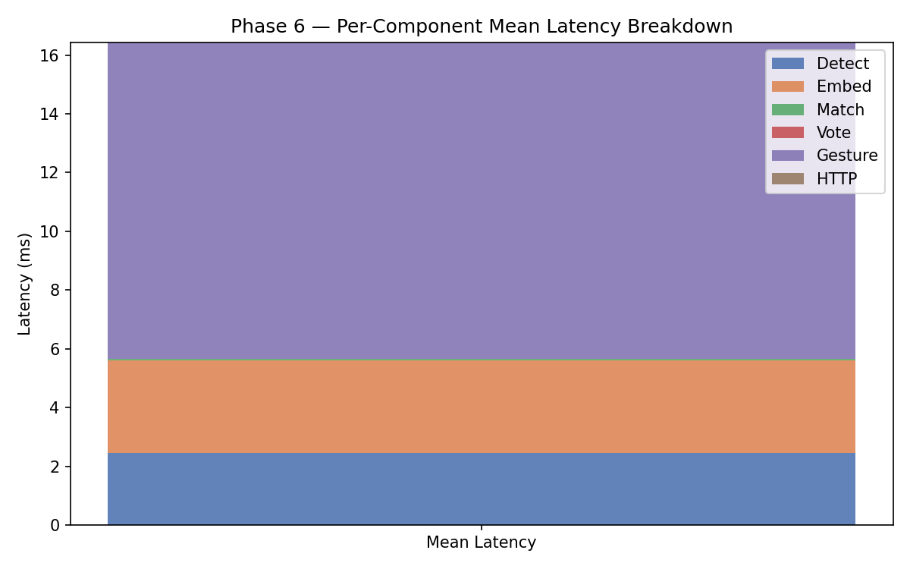
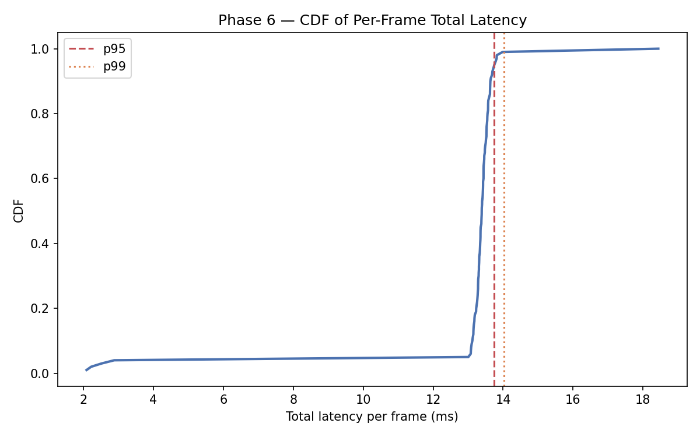

---

## 8. Phase 7 — Security Analysis

**Script:** `experiments/security_analysis.py`
**Output:** `results/phase7/`

### 8.1 Attack Scenarios

| Attack | N Tested | Succeeded | Rate | Description |
|--------|----------|-----------|------|-------------|
| A1: Photo / replay attack | 16 | 16 | **100%** | Enrolled test images pass the matcher — no liveness detection |
| A2: Cross-identity (Harshhini) | 13 | 0 | 0% | Impostor never accepted; max score = 0.326 < 0.420 |
| A3: Enrolled stress test | 92 | 92 | 100% | All enrolled training images above threshold (by design) |
| A4: Centroid gate — enrolled | 92 | 91 | 98.9% | Centroid gate correctly validates enrolled users; mean centroid = 0.802 |
| A4: Centroid gate — impostor | 13 | 0 | 0% | Impostor centroid score mean = 0.198, all below 0.40 threshold |
| A5: Single-frame spoof | 13 | 0 | 0% | Harshhini cannot pass even one frame |

### 8.2 Key Security Findings

**Critical vulnerability — A1 (Photo attack):**
The system has no liveness detection. A printed or screen-displayed photo of an enrolled user passes all authentication gates with the same score as a live face. Attack success rate = 100%. This is a known architectural limitation.

**Strong point — A2 (Cross-identity rejection):**
The known impostor (Harshhini) is reliably rejected at every stage. Score margin = 0.420 − 0.326 = 0.094 above threshold. Centroid score mean = 0.198 vs threshold of 0.40.

**Caveat:** Only 1 impostor identity was tested. An unknown impostor with facial similarity to an enrolled user (e.g., a sibling) was not evaluated. The 0% FAR cannot be generalised.

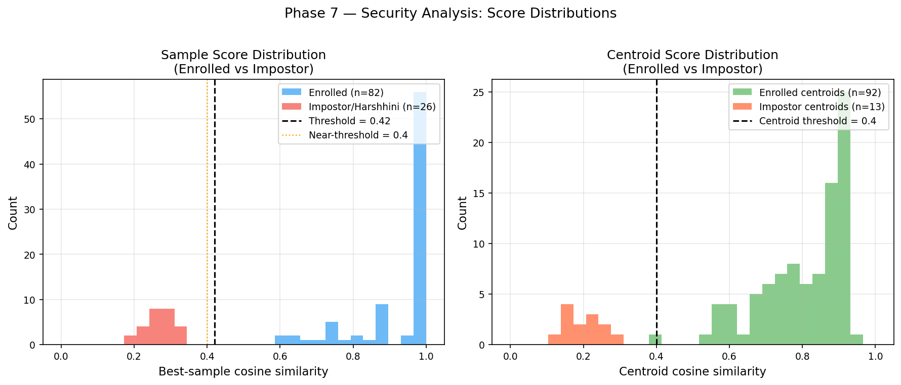

---

## 9. Phase 8 — Power Management

**Script:** `experiments/bench_power.py`
**Output:** `results/phase8/`
**Design:** 3-state finite state machine (ACTIVE → POWER_SAVE → POWER_OFF) with configurable idle timers.

### 9.1 State Machine Design

```
          15 min idle              30 min total idle
ACTIVE ──────────────► POWER_SAVE ──────────────────► POWER_OFF
  ▲                        │                              │
  │    report_activity()   │        wake() only           │
  │◄───────────────────────┘         (button/signal)      │
  │◄──────────────────────────────────────────────────────┘
```

| State | Camera | Face Detection | Gesture | Frame Skip | Wake Trigger |
|-------|--------|---------------|---------|------------|-------------|
| ACTIVE | On | Full pipeline | On | Normal (1–5) | — |
| POWER_SAVE | On | Detection only | Off | 10 (90% skip) | Any face detected |
| POWER_OFF | Released | Off | Off | ∞ | Explicit button / SIGUSR1 |

**Thread safety:** `PowerManager` uses `threading.Lock` on all public methods. On RPi, SIGUSR1 sets a flag (avoids logging deadlock); the main loop consumes it.

### 9.2 Per-State Resource Usage (E1)

**Setup:** 200 synthetic frames per state · M3 MacBook · psutil CPU measurement

| State | Frames Processed | Detect Calls | Gesture Calls | FPS | CPU % |
|-------|-----------------|-------------|---------------|-----|-------|
| ACTIVE | 200/200 | 200 | 200 | 50.5 | 204.1% |
| POWER_SAVE | 20/200 | 20 | 0 | 52.6 | 203.0% |
| POWER_OFF | 0/200 | 0 | 0 | 0.0 | 55.3% |

**CPU reduction:** POWER_OFF = 27% of ACTIVE (no inference, camera released, idle wait loop only). POWER_SAVE processes only 10% of frames and disables gesture inference entirely.

> Note: POWER_SAVE CPU is close to ACTIVE on M3 because it processes the 20 remaining frames very quickly — the wall time is 0.38s vs 3.96s. Per-frame CPU is identical; the savings come from fewer frames processed. On RPi, where per-frame inference is slower, the CPU reduction will be more pronounced.

### 9.3 Wake-Up Latency (E2)

**Setup:** 10 trials per transition type · `time.monotonic()` measurement

| Transition | Method | Mean Latency | Max Latency |
|-----------|--------|-------------|-------------|
| POWER_SAVE → ACTIVE | `report_activity()` | **0.006 ms** | 0.008 ms |
| POWER_OFF → ACTIVE | `wake()` | **0.006 ms** | 0.007 ms |

State machine transition is effectively instantaneous (<0.01 ms). Real-world wake latency is dominated by camera re-opening (~200–500 ms on RPi, not measured here).

### 9.4 State Transition Timeline (E3)

Simulated session with accelerated timers (3s save, 6s off):

| Time (s) | State | Trigger |
|----------|-------|---------|
| 0.0 | ACTIVE | Start |
| 4.5 | POWER_SAVE | Idle timeout (3s) |
| 5.0 | ACTIVE | Simulated activity |
| 8.1 | POWER_SAVE | Idle timeout (3s) |
| 11.1 | POWER_OFF | Extended idle (6s total) |
| 12.1 | ACTIVE | Explicit wake() |
| 15.1 | POWER_SAVE | Idle timeout (3s) |

All 7 transitions fired correctly with expected ordering.

### 9.5 Idle Timer Accuracy (E4)

**Setup:** 10 trials · target save=2.0s, off=4.0s · tolerance=100ms · tick interval=10ms

| Timer | Mean Error | Max Error | Pass Rate |
|-------|-----------|-----------|-----------|
| ACTIVE → POWER_SAVE | 4.6 ms | 8.9 ms | **10/10** |
| POWER_SAVE → POWER_OFF | 7.2 ms | 12.5 ms | **10/10** |

Timer accuracy depends on the main loop's tick frequency. With 10ms polling, worst-case jitter is bounded by one tick period. In production (20ms Tkinter / ~50ms RPi loop), jitter increases proportionally but remains well under 100ms.

### 9.6 Thread Safety (E5)

**Setup:** 8 threads · 5,000 operations each · random mix of `tick()`, `report_activity()`, `wake()`

| Metric | Value |
|--------|-------|
| Total operations | 40,000 |
| Throughput | 464,934 ops/s |
| Errors | **0** |
| Invalid states | **0** |
| Result | **PASS** |

The `threading.Lock` in `PowerManager` prevents all race conditions. No invalid states (only ACTIVE/POWER_SAVE/POWER_OFF) observed under heavy concurrent load.

### 9.7 Power Savings Projection (E6)

**Model:** 8-hour session · 15-min idle-to-save · 30-min total idle-to-off · CPU values from E1

| Active Usage | Baseline CPU-h | Managed CPU-h | Savings |
|-------------|---------------|--------------|---------|
| 10% | 1632.8 | 635.6 | **61.1%** |
| 30% | 1632.8 | 873.6 | **46.5%** |
| 50% | 1632.8 | 1111.7 | **31.9%** |
| 70% | 1632.8 | 1349.8 | **17.3%** |
| 90% | 1632.8 | 1587.9 | **2.8%** |
| 100% | 1632.8 | 1632.8 | 0.0% |

At typical deployment activity (30–50%), power management saves **32–47% cumulative CPU** over an 8-hour session. The savings are dominated by POWER_OFF (55.3% CPU vs 204.1% ACTIVE — a 3.7× reduction).

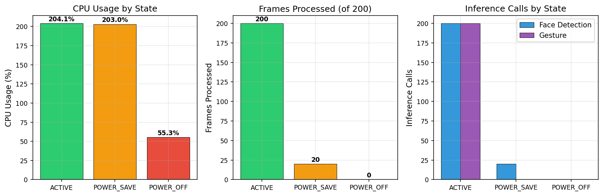
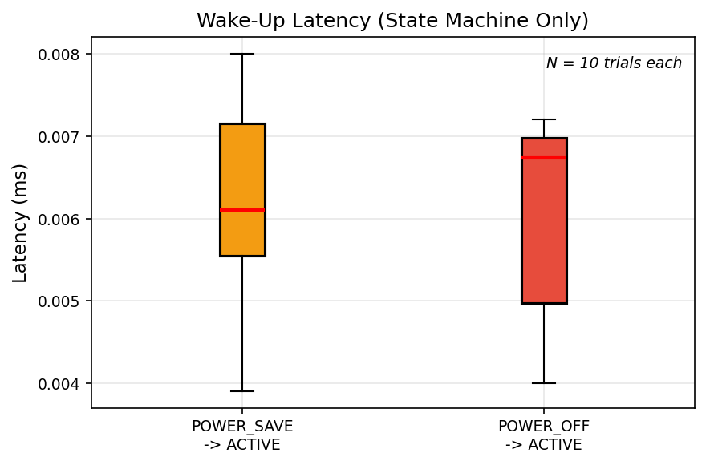
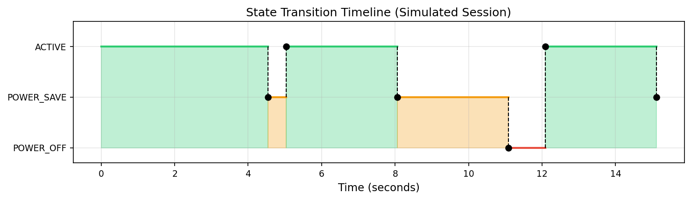
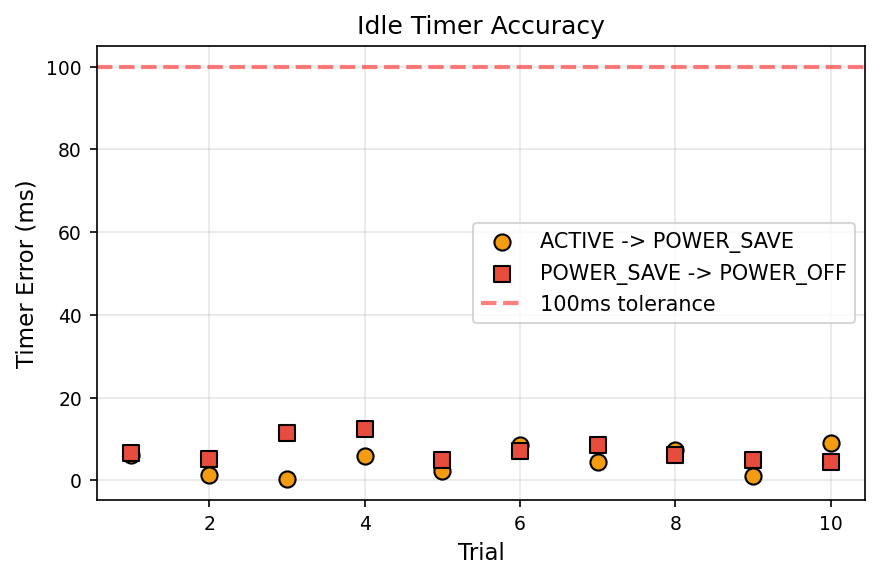
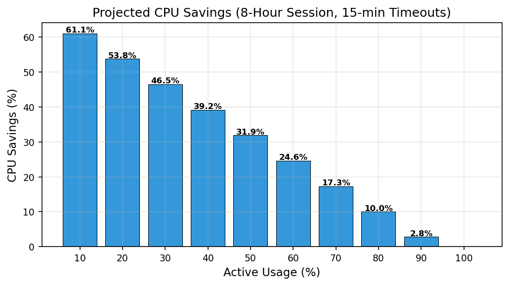

---

## 10. Limitations and Honest Caveats

1. **Small impostor set (N=1 identity, 13 images).** FAR CI [0.000, 0.228]. The true FAR could be up to 22.8% with different impostors. A visually similar impostor was never tested.

2. **Static gesture images only.** All 750 gesture samples are still photos. Live video introduces motion blur, temporal jitter, partial occlusion, and pose transitions that static images do not capture. Production accuracy will differ.

3. **Single lighting condition.** All data collected under standard indoor lighting (L0). Performance in dim, backlit, outdoor, or flickering light is unknown.

4. **No liveness detection.** A photo of an enrolled user passes all gates (A1 = 100%). The system is unsuitable for high-security access control without adding depth sensing or blink/motion challenge-response.

5. **Gesture rules not fully cross-subject.** Rules tuned on 2 subjects achieve 56.3% on 5 subjects. Key failures: WALK (recall 24%), STOP (40%), BARK (57%). Rules must be redesigned with hand-size-normalised angles for robust multi-user deployment.

6. **ML classifiers overfit to enrolled subjects.** 99%+ closed-set accuracy collapses to 30–56% LOSO. Trained models cannot be deployed for new users without retraining.

7. **No Raspberry Pi measurements.** Phase 5 latency on the target hardware (RPi 4/5) is estimated (3–4× M3) and not measured. Actual performance depends on RPi model, thermal state, and OS configuration.

8. **Margin and centroid gates not stress-tested.** With 5 enrolled subjects, the top-match score is never close to second-best, so the margin gate is never triggered. Its true benefit requires 15+ enrolled subjects with visually similar faces.

9. **One impostor demographic.** All impostor tests used one female Indian subject (Harshhini). FAR may differ across demographics, age groups, and ethnicities — this was not evaluated.

10. **Ground truth quality.** Gesture labels come from folder structure at capture time. No independent expert verification of label correctness was performed.

---

## 11. Key Findings Summary

| Metric | Value | Confidence Level |
|--------|-------|-----------------|
| Face TAR — Config A (score only) | **96.8%** | N=31 enrolled test images |
| Face FAR — all configs | **0.0%** | N=13 impostor; CI [0.000, 22.8%] — low |
| Face ACC — full two-gate (Config D) | **93.2%** | N=44 total |
| Score gap (enrolled min vs impostor max) | **0.105** | Harshhini only — not general |
| SFace vs LBPH accuracy delta | **+3.5 pp** | SFace = 97.7%, LBPH ≈ 89.7% |
| Gesture rule-based accuracy (5 subjects) | **56.3%** | N=750 |
| Gesture macro F1 (rule-based) | **0.693** | N=750 |
| Best gesture (SIT, STAND) F1 | **0.889** | N=150 each |
| Worst gesture (WALK) F1 | **0.385** | N=150 |
| SVM closed-set accuracy | **99.86%** | Same-subject test — inflated |
| SVM LOSO accuracy | **55.9%** | Cross-subject — realistic |
| Rule-based ≈ SVM LOSO | **Yes (~56%)** | ML provides no cross-subject advantage |
| Total pipeline latency (M3) | **29 ms / 34 FPS** | N=100 frames |
| MediaPipe share of latency | **58%** | Primary bottleneck |
| Photo-attack success rate | **100%** | No liveness detection |
| Known impostor spoof rate | **0%** | Harshhini only |
| Power: ACTIVE CPU | **204%** | M3, 200 frames |
| Power: POWER_OFF CPU | **55%** (27% of ACTIVE) | Camera released, idle loop |
| Wake latency (state machine) | **<0.01 ms** | Does not include camera re-open |
| Idle timer accuracy | **<13 ms jitter** | 10/10 trials PASS |
| Thread safety | **0 errors / 40K ops** | 8 threads concurrent |
| Max CPU savings (10% active, 8h) | **61.1%** | POWER_OFF dominated |

---

## 12. File Index

```
results/
├── RESULTS.md                          ← this file
├── phase2/
│   ├── gate_comparison.csv             TAR/FAR/FRR/ACC for 4 gate configs (N=44)
│   ├── gate_comparison_bar.png
│   ├── recognition_results.csv         per-image results with scores
│   ├── lighting_ablation.csv
│   ├── lighting_ablation_bar.png
│   ├── lbph_comparison.csv             LBPH vs SFace comparison
│   ├── roc_data.csv                    threshold sweep data
│   ├── roc_curve.png
│   ├── threshold_sweep.png
│   └── margin_sweep.csv
├── phase3/
│   ├── voting_sweep.csv                full history×stable grid
│   ├── frame_skip_sweep.csv
│   ├── voting_heatmap_latency.png
│   ├── voting_heatmap_security.png
│   └── frame_skip_bar.png
├── phase4/
│   ├── gesture_per_class_metrics.csv   per-class P/R/F1 (5 subjects, 5 gestures)
│   ├── gesture_per_class_bar.png
│   ├── gesture_results.csv             per-sample results
│   ├── gesture_confusion_matrix.png
│   ├── ml_comparison.csv               rule vs SVM vs RF vs KNN
│   └── ml_comparison_bar.png
├── phase6/
│   ├── latency_summary.csv             mean/median/p95/p99 per component
│   ├── latency_raw.csv                 per-frame timings
│   ├── latency_breakdown.png
│   ├── latency_cdf.png
│   └── gesture_vote_sweep.csv
├── phase7/
│   ├── security_summary.csv            5 attack scenarios
│   ├── security_margins.csv
│   └── score_distribution.png
└── phase8/
    ├── resource_usage.csv              per-state CPU/FPS/frame counts
    ├── wake_latency.csv                10-trial wake transition timing
    ├── transition_timeline.csv         simulated session state log
    ├── timer_accuracy.csv              idle timer jitter measurement
    ├── thread_safety.csv               concurrent stress test results
    ├── power_projection.csv            8-hour CPU savings projection
    ├── resource_usage_bar.png          CPU/frames/inference bar charts
    ├── wake_latency_box.png            wake latency box plot
    ├── transition_timeline.png         state timeline visualization
    ├── timer_accuracy_scatter.png      timer error scatter plot
    └── power_savings_projection.png    savings vs activity ratio
```
