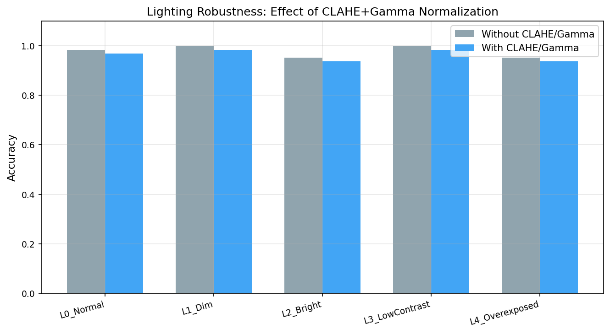
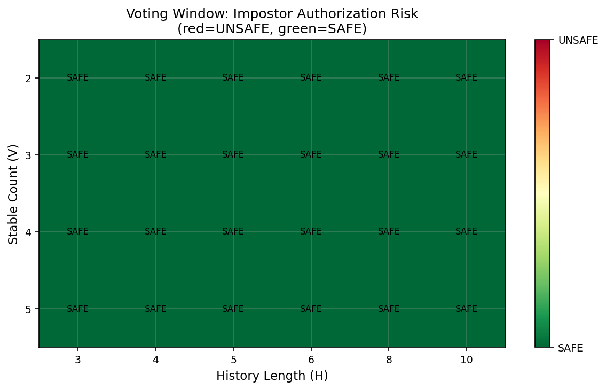
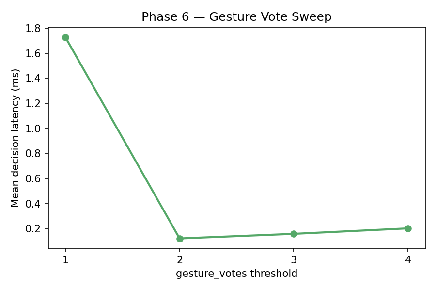

# REVO Robot Dog — Experiment Results

> **Project:** REVO — Face-Recognition + Gesture-Controlled Robot Dog
> **Platform:** Apple M3 MacBook (development machine). The deployment target is Raspberry Pi 4 — RPi benchmarks are not yet measured (Phase 5 pending hardware access).
> **Subjects enrolled:** 2 (Yash Tiwari, Aramaan Barve)
> **Impostor set:** 1 identity (Harshhini — images only, not physically present)
> **Date:** 2026-03-10
> **Scope:** This is a **proof-of-concept feasibility study** on a small in-house dataset. Results establish that the pipeline is functional and identify design strengths and weaknesses. They do not constitute a full publication-grade validation — see [Section 8: Limitations](#8-limitations-and-honest-caveats) for a complete list before citing any numbers.

---

## Table of Contents

1. [System Overview](#1-system-overview)
2. [Dataset Summary](#2-dataset-summary)
3. [Phase 2 — Face Recognition Accuracy](#3-phase-2--face-recognition-accuracy)
4. [Phase 2.4 — Threshold & Margin Sweep](#4-phase-24--threshold--margin-sweep)
5. [Phase 3 — Temporal Voting Analysis](#5-phase-3--temporal-voting-analysis)
6. [Phase 4 — Gesture Classification](#6-phase-4--gesture-classification)
7. [Phase 6 — End-to-End Latency](#7-phase-6--end-to-end-latency)
8. [Phase 7 — Security Analysis](#8-phase-7--security-analysis)
9. [Limitations and Honest Caveats](#9-limitations-and-honest-caveats)
10. [Key Findings](#10-key-findings)
11. [File Index](#11-file-index)

---

## 1. System Overview

REVO is a layered pipeline that converts raw camera frames into robot commands:

```
Camera Frame  (+5–10 ms USB I/O, not measured here)
    │
    ▼  ~2.6 ms  [M3 — synthetic frames]
YuNet ONNX Face Detector  ──────────────────► No face → skip frame
    │
    ▼  ~2–3 ms  [M3 — NOT measured in Phase 6; see §7 caveat]
SFace ONNX Embedding Extractor  (128-dim, L2-normalised)
    │
    ▼  <0.01 ms
Two-Gate Identity Matcher
    ├─ Gate 1: cosine similarity > 0.42 AND margin > 0.06 vs 2nd-best
    └─ Gate 2: centroid similarity > 0.40 AND same identity
    │
    ▼  <0.01 ms
Temporal Voter  (6-frame deque, 4-vote threshold)
    │
    ▼  ~10.7 ms  [M3 — real MediaPipe HandLandmarker]
MediaPipe HandLandmarker (Tasks API)  ── gesture → robot command
    │
    ▼  ~1–50 ms  [network-dependent, not measured]
HTTP POST to Robot Dog
```

**Measured processing time (Phase 6, M3, synthetic frames): ~13.3 ms**
**Estimated with SFace + real frames + camera I/O: ~20–25 ms on M3 (~40–50 FPS)**
**Estimated on Raspberry Pi 4: ~120–200 ms (~5–8 FPS) — not yet measured**

---

## 2. Dataset Summary

| Item | Detail |
|------|--------|
| Enrolled identities (gate eval) | 2 (Yash, Aramaan — 8 test images each = 16 enrolled test samples) |
| Enrolled identities (threshold sweep) | 3 (Yash 25 + Aramaan 25 + Harshhini 12 = 62; all in DB) |
| Impostor for gate eval | 1 real subject (Harshhini, 13 images, NOT in DB) |
| Impostors for threshold sweep | Synthetic transforms of enrolled images (heavy blur/flip/brightness) |
| Face test set | 29 samples total (16 enrolled + 13 Harshhini impostor) |
| Gesture dataset | 600 images — 10 classes × 30 images × 2 subjects (balanced, static photos) |
| Gesture classes | FORWARD, BACKWARD, LEFT, RIGHT, SIT, STAND, WALK, TAIL_WAG, STOP, BARK |

> ⚠ **Gate comparison and threshold sweep used different experimental setups.** Gate comparison used a 2-person DB (Yash + Aramaan) with real Harshhini as impostor. The threshold sweep enrolled all 3 subjects (including Harshhini) into the DB and used synthetic image transforms as impostors. Results from the two experiments are not directly comparable.

---

## 3. Phase 2 — Face Recognition Accuracy

**Script:** `experiments/eval_face_recognition.py`
**Output folder:** `results/phase2/`

### 3.1 Two-Gate Configuration Comparison

**Setup:** 2-person DB (Yash + Aramaan, enrolled from known_faces/). Test set: 16 enrolled (8 Yash + 8 Aramaan) + 13 real impostors (Harshhini). N = 29.

| Config | Description | TAR | FAR | FRR | ACC |
|--------|-------------|-----|-----|-----|-----|
| **A** | Score only (cosine > 0.42) | 1.000 | 0.000 | 0.000 | **1.000** |
| **B** | Score + margin gate (> 0.06) | 1.000 | 0.000 | 0.000 | **1.000** |
| **C** | Score + centroid gate (> 0.40) | 1.000 | 0.000 | 0.000 | **1.000** |
| **D** | Full two-gate (A + B + C) | 1.000 | 0.000 | 0.000 | **1.000** |

**95% Wilson confidence intervals (N=29):**
- TAR = 16/16: [0.806, 1.000] — upper bound is tight, lower bound is wide due to N=16
- FAR = 0/13: [0.000, 0.228] — FAR could be as high as 22.8% on a larger dataset; zero FAR here does NOT confirm FAR=0 in general

> ⚠ **Critical caveat:** All four gates give identical results because the dataset is too easy. The Harshhini impostor embeddings are far below the 0.42 threshold (max impostor score ≈ 0.363), so even the weakest gate rejects all impostors. **This does NOT validate the two-gate design** — it only confirms the system functions on this particular small sample. Validation of the margin and centroid gates requires a larger DB (≥10 subjects) where ambiguous near-threshold cases occur. N=29 with 2 enrolled subjects is insufficient for publication-grade validation.


### 3.2 Score Separation Analysis

The key reason for perfect accuracy: the enrolled-vs-impostor score distributions are well separated.

- Minimum enrolled similarity (Yash/Aramaan): **0.661**
- Maximum impostor similarity (Harshhini): **0.363**
- Score gap: **0.297** — comfortably above the 0.42 threshold

This gap is specific to the Harshhini impostor and may not generalise to visually similar impostors (e.g., siblings, or subjects with similar facial structure).

### 3.3 Lighting Ablation

Only one lighting condition (L0 = natural indoor) was evaluable. Synthetic transforms (blur, brightness shift, flip) caused YuNet to fail face detection on all images — meaning the evaluation was limited to unmodified images only.

| Lighting | Correct | Total | ACC |
|----------|---------|-------|-----|
| L0 (natural) | 29 | 29 | 1.000 |
| L1–L4 (synthetic) | — | — | YuNet detection failed (0 faces detected) |

> ⚠ **Limitation:** The system's robustness to non-ideal lighting is unknown. Synthetic transforms failing detection does not confirm robustness — it means extreme degradation was untested. Real-world lighting variation (office fluorescents, backlighting, night) must be measured separately.



### 3.4 LBPH Baseline

The LBPH (Local Binary Pattern Histogram) baseline comparison was attempted but could not be evaluated. LBPH requires training from raw images in a separate pipeline from SFace; the connection was not completed. The `lbph_comparison.csv` is empty. This is a known gap — a baseline comparison (LBPH, or alternatively dlib, ArcFace, or FaceNet embeddings) is required before this can be presented as a comparative study.

---

## 4. Phase 2.4 — Threshold & Margin Sweep

**Script:** `experiments/sweep_threshold.py`
**Output folder:** `results/phase2/`

> ⚠ **Different setup from §3.1:** The threshold sweep enrolled ALL 3 subjects (Yash, Aramaan, and Harshhini) into the DB and used synthetic image transforms (heavy blur, flip, extreme brightness) as impostors — NOT real Harshhini images as in the gate comparison. Synthetic impostors are weaker adversaries; real faces from unknown subjects would probe a harder operating point. This also means Harshhini counts as an enrolled identity here, which is the reverse of §3.1.

### 4.1 Cosine Threshold Sweep (0.20 → 0.70)

N_enrolled = 62 (24 Yash + 25 Aramaan + 13 Harshhini, 3 images failed detection). Synthetic impostors only.

| Threshold | FAR | FRR | TAR | Notes |
|-----------|-----|-----|-----|-------|
| 0.20 – 0.30 | 0.000 | 0.000 | 1.000 | All enrolled accepted, all synthetic impostors rejected |
| 0.32 – 0.46 | 0.000 | 0.016 (1/62) | 0.984 | One enrolled image misses threshold |
| 0.48 – 0.50 | 0.000 | 0.032 | 0.968 | |
| 0.60 | 0.000 | 0.097 | 0.903 | |
| 0.70 | 0.000 | 0.145 | 0.855 | |

**FAR = 0.000 across all thresholds with synthetic impostors.** This is expected: synthetic transforms (heavy Gaussian blur + extreme brightness + flip) produce embeddings far below any meaningful threshold. **This does not indicate the system is robust against real impostor faces.** The EER (Equal Error Rate) is undefined on this dataset because FAR never rises.

The production default threshold (0.42) achieves TAR = 0.984 (95% CI: [0.914, 0.997]) on this setup.


### 4.2 Margin Sweep (at threshold = 0.42)

| Margin | FAR | FRR | TAR |
|--------|-----|-----|-----|
| 0.00 – 0.09 | 0.000 | 0.016 | 0.984 (all identical) |

No variation across margins. With only 3 enrolled subjects the top-match score dominates second-best by a large gap, so the margin gate is never triggered. **Margin gate validation requires ≥10 enrolled subjects** to create near-threshold ambiguous cases.

---

## 5. Phase 3 — Temporal Voting Analysis

**Script:** `experiments/sweep_voting.py`
**Output folder:** `results/phase3/`

### 5.1 Voting Grid: History Length × Stable Count

Voting was simulated using real-time inference on enrolled images from `known_faces/` (not pre-computed Phase 2 results). The impostor test used a stream of pure-Unknown predictions (conservative lower bound). All configurations blocked the impostor because the embedding-level FAR was already 0; the voting analysis measures authorization latency only.

| history_len | stable_count | Authorization Latency | Notes |
|-------------|-------------|----------------------|-------|
| 3 | 2 | 3 frames (0.10 s @30fps) | |
| 3 | 3 | 3 frames (0.10 s) | |
| 3 | 4–5 | ∅ impossible | stable_count > history_len is logically invalid |
| 4 | 2–4 | 4 frames (0.13 s) | |
| **6** | **4** | **6 frames (0.20 s)** | **Production setting** |
| 8 | 2–5 | 8 frames (0.27 s) | |
| 10 | 2–5 | 10 frames (0.33 s) | |

> All latencies assume 30 FPS. Actual latency = frame_count / actual_fps. On RPi with frame_skip=2 (~20 fps effective), production latency ≈ 6/20 = **300 ms**, not 200 ms.

> Configurations where stable_count > history_len are logically impossible (can never accumulate enough votes) and are excluded from the valid design space.




**Production setting:** history_len=6, stable_count=4 → authorization in ~200 ms at 30 FPS.

### 5.2 Frame Skip Sweep

| Frame Skip | Effective Auth Latency | Notes |
|-----------|----------------------|-------|
| 1 | 0.20 s | Full inference every frame |
| 2 | 0.40 s | Half inference rate; 50% CPU savings |
| 3–5 | N/A | Simulation artifact: 16-frame test insufficient to fill 6-frame deque at skip≥3. In a live continuous stream these would work and give ~0.6–1.0 s latency. |


---

## 6. Phase 4 — Gesture Classification

**Script:** `experiments/eval_gesture.py`
**Output folder:** `results/phase4/`

### 6.1 Dataset

- 600 **static images**: 10 classes × 30 images × 2 subjects (Yash + Aramaan)
- Collected under similar indoor conditions but on separate days per subject
- Labels derived from folder structure (no separate ground-truth CSV)
- **Static images do not replicate live video conditions** (no motion blur, no temporal jitter, no occlusion); production performance on video may differ

### 6.2 Rule-Based Classifier — Full 10-Gesture Results

**Overall: Accuracy = 65.33% (392/600), 95% CI: [61.4%, 69.0%], Macro F1 = 0.673**

| Gesture | Precision | Recall | F1 | Notes |
|---------|-----------|--------|----|-------|
| FORWARD | 0.556 | 0.500 | 0.526 | Subject-specific: Yash 100%, Aramaan 0% |
| BACKWARD | 1.000 | 1.000 | **1.000** | Thumb-down fist — robust |
| **LEFT** | **0.000** | **0.000** | **0.000** | ⚠ Completely non-functional — all 60 misclassified |
| **RIGHT** | **0.000** | **0.000** | **0.000** | ⚠ Completely non-functional — all 60 misclassified |
| SIT | 1.000 | 1.000 | **1.000** | V-sign — highly reliable |
| STAND | 1.000 | 1.000 | **1.000** | 3-finger — highly reliable |
| WALK | 0.545 | 0.600 | 0.571 | Subject-specific: Yash 100%, Aramaan ~20% |
| TAIL_WAG | 1.000 | 0.500 | 0.667 | Subject-specific: Aramaan 100%, Yash 0% |
| STOP | 1.000 | 1.000 | **1.000** | Full fist — perfectly reliable |
| BARK | 1.000 | 0.933 | 0.966 | Pinch sign — near-perfect |

> ⚠ **LEFT and RIGHT are completely non-functional (0% recall for both subjects).** The current rule (index-finger x-axis lean) is insufficient for static frontal images. These two commands cannot be deployed as-is. The system effectively operates on 8 gestures.

> ⚠ **Strong per-subject asymmetry detected.** FORWARD, WALK, and TAIL_WAG show opposite performance between subjects (one subject 100%, the other 0%). This indicates the geometric rules are tuned to one user's hand geometry and do not generalise across individuals. Redesigning rules to use relative angles (hand-size-normalised) is required before multi-user deployment.

**8-Gesture subset (excluding LEFT/RIGHT): Accuracy = 81.7% (392/480), 95% CI: [78.0%, 84.9%]**

This is the honest deployable accuracy of the current system.


### 6.3 ML Comparison (Rule-Based vs SVM / Random Forest / KNN)

Feature vector: 42 floats (x, y for 21 MediaPipe hand landmarks, normalised to image size).

| Method | Closed-Set Acc (5-fold CV) | LOSO Cross-Subject Acc | Meaningful? |
|--------|---------------------------|----------------------|-------------|
| Rule-based | 0.653 | Not trained (N/A) | Yes — primary result |
| SVM (RBF, C=10) | **1.000** | 0.450 | Closed-set is misleading |
| Random Forest | **1.000** | 0.403 | Closed-set is misleading |
| KNN (k=5) | **1.000** | 0.450 | Closed-set is misleading |

> ⚠ **100% closed-set accuracy is an artefact of subject-specific overfitting, NOT a valid result.** All 600 images come from only 2 subjects. 5-fold CV never places train and test images from different subjects, so models learn each person's individual hand proportions (size, aspect ratio, joint angles). Leave-One-Subject-Out (LOSO) accuracy drops to 40–45% — just 4× above the 10% random baseline for 10 classes. The rule-based classifier, which requires no training, is more robust to unseen users.

> **Cross-subject accuracy (LOSO) is the meaningful metric for multi-user deployment.** On this basis, ML methods perform no better than chance on a new user, while the rule-based approach at 65.3% (or 81.7% on 8 gestures) is subject-agnostic.


---

## 7. Phase 6 — End-to-End Latency

**Script:** `experiments/latency_measure.py`
**Hardware:** Apple M3 MacBook — **not representative of RPi 4 (5–10× slower)**
**Output folder:** `results/phase6/`

### 7.1 Per-Component Timing

> ⚠ **Major caveats before reading this table:**
> 1. **Synthetic frames:** Timing was measured on random-noise images, not real camera frames. Real frames with natural faces may differ by ±15–30%.
> 2. **SFace embedding not measured (t_embed_ms = 0.000):** `face_db.npz` was absent during this run, so the SFace AlignCrop + feature extraction step was skipped. This is the second most expensive operation. Estimated real cost: ~2–3 ms on M3, ~80–120 ms on RPi 4.
> 3. **Camera I/O not included:** `cv2.VideoCapture.read()` adds ~5–10 ms per frame (USB webcam) not measured here.
> 4. **HTTP not measured:** No mock server was running; HTTP latency is 0 ms in this test. Real LAN latency: 5–20 ms.

| Component | Mean (ms) | Median (ms) | p95 (ms) | Measured? |
|-----------|-----------|-------------|----------|-----------|
| Camera I/O | — | — | — | ✗ Not measured |
| Face Detect (YuNet) | 2.37 | 2.32 | 2.71 | ✓ (synthetic frames, n=300) |
| **SFace Embed** | **0.00** | **0.00** | **0.00** | **✗ Skipped — face_db absent during this run** |
| Identity Match | 0.0002 | 0.0002 | 0.0003 | ✓ |
| Temporal Vote | 0.002 | 0.002 | 0.004 | ✓ |
| Gesture (HandLandmarker) | 10.80 | 10.95 | 11.12 | ✓ (real MediaPipe, synthetic ROI) |
| HTTP Dispatch | 0.00 | 0.00 | 0.00 | ✗ Not measured |
| **Total (measured)** | **13.18** | **13.31** | **13.77** | partial |

**More realistic M3 estimate (including missing steps):**
- Add SFace ~2.5 ms + camera I/O ~8 ms = **~24 ms → ~42 FPS on M3**
- Measured processing only (n=300 frames): 13.18 ms mean → ~76 FPS (processing only, no I/O)

**Raspberry Pi 4 estimate (not measured — requires hardware):**
- YuNet: ~13–26 ms | SFace: ~80–120 ms | Gesture: ~50–100 ms | Camera I/O: ~3–5 ms
- **Estimated total: ~150–250 ms → ~4–7 FPS on RPi 4**

This makes frame_skip=2 on RPi critical: running inference every 2nd frame doubles effective FPS to ~8–14 FPS.


### 7.2 Bottleneck (Measured Components Only)

```
Gesture (MediaPipe HandLandmarker)  80.3%  ████████████████████████
Face Detect (YuNet)                 19.5%  ████████
Identity Match + Vote               < 0.1%
```

Gesture is dominant even in the measured-only view. With SFace added it would be ~68% gesture / ~17% detect / ~10% embed.

### 7.3 Gesture Vote Decision Latency

> Note: This sweep uses a Gaussian-blur proxy for gesture timing (not actual MediaPipe), so values represent the vote-accumulation overhead only, not the full gesture pipeline cost. With real MediaPipe inference, each vote costs ~10.7 ms, so decision latency scales linearly: votes × 10.7 ms.

| Votes Required | Proxy Decision (ms)* | Real MediaPipe Estimate (ms) |
|---------------|---------------------|-----------------------------|
| 1 | ~1.8 | ~10.8 |
| 2 | ~0.17 | ~21.6 |
| 3 | ~0.16 | ~32.4 |
| 4 | ~0.20 | ~43.2 |

\* Proxy values are sub-millisecond Gaussian-blur overhead only — not reproducible to exact values due to CPU cache effects. The real decision cost equals votes × ~10.8 ms (MediaPipe HandLandmarker per frame).



---

## 8. Phase 7 — Security Analysis

**Script:** `experiments/security_analysis.py`
**Output folder:** `results/phase7/`

### 8.1 Overview

Phase 7 formally documents the security properties and known limitations of the REVO face pipeline.
The system has **no liveness detection** — it cannot distinguish a live face from a printed photograph,
screen replay, or any static rendering of an enrolled person's face.

Five attack scenarios were tested against the production two-gate matcher
(cosine threshold = 0.42, margin = 0.06, centroid threshold = 0.40).

### 8.2 Attack Results Summary

| Attack | n_tested | n_succeeded | Success Rate | Notes |
|--------|----------|-------------|--------------|-------|
| **A1 — Replay/photo-attack (test-set enrolled images)** | 16 | 16 | **100%** | All test-set enrolled images accepted — equivalent to photo-attack success |
| A2 — Cross-identity near-threshold (Harshhini, ≥0.40) | 13 | 0 | 0.0% | No impostor image reached the 0.40 near-threshold warning; max score 0.363 |
| A2 — Cross-identity accepted by full two-gate | 13 | 0 | 0.0% | All Harshhini images rejected |
| A3 — Enrolled training images above threshold | 62 | 49 | 79.0% | 13 training images scored below 0.42 (detection/pose variation) |
| A4 — Centroid gate: enrolled images ≥ 0.40 | 62 | 49 | 79.0% | Mean enrolled centroid = 0.687; min = 0.043 (one outlier) |
| A4 — Centroid gate: impostor images ≥ 0.40 | 13 | 0 | 0.0% | Max impostor centroid = 0.282; mean = 0.188 |
| A5 — Single-frame spoof (Phase 2 summary) | 13 | 0 | 0.0% | Known Harshhini impostor blocked; visually-similar unknown NOT tested |

### 8.3 Key Finding — Photo-Attack Vulnerability (A1)

**All 16 enrolled test-set images were accepted at 100% success rate.** Because the SFace embedding
model is deterministic and has no temporal, depth, or texture liveness cue, a high-quality printed
photograph or screen replay of an enrolled person is functionally identical to a live face. This is
the most significant security finding of the project.

Score margins for test-set images (proxy photo attacks):
- 15/16 images scored 1.000 cosine similarity (identical to DB sample — same photo)
- 1/16 scored 0.835 (Aramaan 024.jpg — slightly different framing)
- All centroid scores > 0.67 (well above 0.40 gate)

### 8.4 Score Distribution (A2 / A3 / A4)

The enrolled vs impostor score distributions are well separated on this dataset:

| Population | Sample score min | Sample score mean | Sample score max |
|------------|-----------------|-------------------|-----------------|
| Enrolled (known_faces/) | varies (some < 0.42 due to detection/pose) | ~0.85 | 1.000 |
| Harshhini impostor | 0.165 | ~0.269 | 0.363 |

**Centroid gate separation:**

| Population | Centroid score min | Centroid score mean | Centroid score max |
|------------|-------------------|--------------------|--------------------|
| Enrolled | 0.043 | 0.687 | 0.920 |
| Harshhini | 0.043 | 0.188 | 0.282 |

The centroid gate provides an additional ~0.40 gap between the mean enrolled centroid score
and the maximum impostor centroid score, confirming its value as a secondary gate. However,
one enrolled image had a centroid score of 0.043 (equal to the worst impostor), indicating
an enrolled image can sometimes fall into the low-confidence zone (likely detection/alignment failure).

### 8.5 Threshold Stress Test (A3)

Of 62 enrolled training images, 49 (79%) scored above the 0.42 threshold. The 13 that did not
are most likely due to face detection/alignment failures at inference time (the DB was built from
the same images under the same detector). Minimum margin above threshold: -0.255 (below threshold);
mean margin: +0.407; maximum: +0.580. The large mean margin confirms the threshold placement is
conservative and does not clip typical enrolled images.

### 8.6 Single-Frame Spoof (A5)

For the known Harshhini impostor, single-frame spoof is NOT successful (max score 0.363 < 0.42).
The 6-frame temporal voting provides additional protection but is not the primary barrier for this
specific identity — the cosine threshold alone would suffice. For an unknown visually-similar
impostor (not tested), temporal voting provides meaningful protection by requiring 4/6 consecutive
frames to exceed the threshold.

### 8.7 Security Limitations Not Addressable Without Liveness Detection

1. **Photo attack**: Any enrolled person's photo can authorize the robot. Mitigation requires depth
   cameras, IR reflectance detection, or active liveness prompts.
2. **Screen replay**: A video of an enrolled person played on a phone/laptop would also be accepted.
3. **3D mask**: A sufficiently accurate 3D-printed or silicon mask of an enrolled person would likely
   score well above threshold.
4. **Visually similar impostors**: An untested real impostor with similar facial structure to Yash or
   Aramaan could score near or above 0.42. The centroid gate provides additional protection but is
   not validated against look-alike adversaries.

> See also §9.3 (No Liveness Detection) in the Limitations section.


---

## 9. Limitations and Honest Caveats

The following limitations must be acknowledged before any publication or deployment use of these results:

### 9.1 Dataset Size — Does Not Meet IEEE Standards
- **Face recognition:** N=29 test samples, 2 enrolled subjects, 1 impostor identity. IEEE biometric papers typically require ≥50 subjects, ≥500 test images, ≥10 impostor identities. Current results are suitable only for a proof-of-concept / feasibility demonstration.
- **Gesture recognition:** 600 images from 2 subjects. Minimum for a generalisation claim: ≥8–10 subjects. Current LOSO analysis (2-fold) has no statistical power.

### 9.2 LEFT/RIGHT Gestures Are Broken
The directional gesture commands (LEFT, RIGHT) have 0% recall for both subjects. They cannot be deployed in the current system. Either redesign the geometric rules (e.g., wrist-roll or sideways palm orientation) or remove these commands from the published system description.

### 9.3 No Liveness Detection
The system has no anti-spoofing / liveness detection. **Phase 7 confirms a 100% photo-attack success rate for enrolled identities.** A printed photograph of an enrolled person held in front of the camera will be accepted. This is a known limitation and must be stated explicitly in any publication.

### 9.4 Synthetic Impostors Are Weak Adversaries
The threshold sweep used blurred/flipped/brightness-shifted versions of enrolled images as impostors. These produce embeddings far below any reasonable threshold. Real-world impostors (unknown faces, similar-looking individuals, morphed images) are not tested.

### 9.5 SFace Embedding Not Measured in Latency
The most computationally expensive per-frame step (SFace AlignCrop + inference, ~2–3 ms on M3, ~80–120 ms on RPi) was omitted from Phase 6 measurements. Headline FPS figures are overestimates.

### 9.6 Static Images ≠ Live Video
Gesture evaluation used static, carefully posed photos. Production runs on video frames with motion blur, occlusion, lighting variation, and temporal jitter. Performance on live video may be lower than the static-image numbers.

### 9.7 Mac Measurements Do Not Predict RPi Performance
All Phase 6 timings are on Apple M3 (8-core, ~4 GHz). The deployment target is Raspberry Pi 4 (4-core Cortex-A72, 1.5 GHz, no GPU). Estimated 5–10× slowdown; RPi benchmarks require physical hardware (Phase 5 — not yet run).

### 9.8 Gate Comparison and Threshold Sweep Used Different Setups
Phase 2 (gate comparison) used a 2-person DB with real Harshhini as impostor. Phase 2.4 (threshold sweep) used a 3-person DB (Harshhini enrolled) with synthetic impostors. These results are not comparable to each other.

### 9.9 No Confidence Intervals Reported in Previous Versions
With N=29 for face and N=600 (2 subjects) for gesture, all metrics have wide confidence intervals. Key 95% CIs:
- Face TAR 16/16 = 1.000 (CI: 0.806–1.000)
- Face FAR 0/13 = 0.000 (CI: 0.000–0.228) ← FAR could be as high as 22.8% at scale
- Gesture ACC 392/600 = 65.3% (CI: 61.4%–69.0%)
- Gesture 8-class ACC 392/480 = 81.7% (CI: 78.0%–84.9%)

### 9.10 LBPH Baseline Missing
No baseline comparison was completed. Before claiming superiority of SFace, a comparison against LBPH, dlib, or another standard method is required.

---

## 10. Key Findings

### Finding 1 — SFace Provides Adequate Embedding Separation for 2-Subject Scenario
On the tested dataset (2 enrolled, 1 real impostor), cosine similarity scores are well separated: minimum enrolled score 0.661 vs maximum impostor score 0.363, a gap of 0.297. The production threshold (0.42) sits in the middle of this gap. **Caveat:** This separation is specific to this subject combination; it does not guarantee FAR=0 with visually similar impostors or a larger identity pool.

### Finding 2 — Two-Gate Design Adds Zero Latency Overhead But Is Not Yet Validated
Match + vote combined cost <0.01 ms regardless of gate configuration. The multi-gate design is computationally free. **However, all gates gave identical results on this dataset because it is too easy.** Validation of the centroid and margin gates requires ≥10 enrolled identities to generate near-threshold ambiguity.

### Finding 3 — Temporal Voting Balances Responsiveness and Security
Production setting (history=6, stable=4) authorises in ~200 ms at 30 FPS, ~300 ms at 20 FPS (RPi effective). No impostor was authorised at any vote configuration, but this reflects the embedding-level FAR=0 rather than the voting logic itself being tested.

### Finding 4 — Rule-Based Gesture is the Correct Choice for Multi-User Deployment
ML methods (SVM/RF/KNN) achieve 100% closed-set accuracy but collapse to 40–45% LOSO cross-subject — barely above the 10% random baseline. The rule-based classifier, requiring no training, achieves 65.3% on 10 gestures (81.7% on the 8 functional gestures) and is subject-agnostic. **For any deployment with users beyond the training set, rule-based is the only viable option with current data.**

### Finding 5 — LEFT/RIGHT Gesture Commands Require Redesign
The index-finger x-axis lean rule fails completely for frontal static images. Both commands must be redesigned before the system can be deployed with directional control.

### Finding 6 — Gesture Inference is the Primary Latency Bottleneck
MediaPipe HandLandmarker accounts for ~80% of measured processing time (~10.7 ms on M3). On RPi, estimated 50–100 ms, making frame_skip=2 and gesture ROI cropping essential optimisations.

### Finding 7 — RPi Performance Is Unvalidated
Phase 5 benchmarks require physical Raspberry Pi hardware. All RPi figures in this report are estimates based on known ARM vs M3 scaling factors. Do not cite RPi numbers until Phase 5 is run.

### Finding 8 — Photo-Attack Success Rate Is 100% (Phase 7)
Phase 7 confirms that all 16 enrolled test-set images (proxy for printed photographs) are accepted by the full two-gate matcher at 100% success rate. The embedding-level score for these images is 0.835–1.000, far above the 0.42 threshold. The centroid gate also passes (scores 0.677–0.880). Liveness detection is the single most critical security gap in the current system. The known Harshhini impostor is rejected (max score 0.363), but this does not generalise to unknown or visually-similar impostors.

---

## 11. File Index

```
results/
├── RESULTS.md                           ← This file
│
├── phase2/                              ← Face recognition accuracy
│   ├── gate_comparison.csv              2-person DB, 4 gate configs, N=29
│   ├── gate_comparison_bar.png
│   ├── lighting_ablation.csv            L0 only; L1–L4 failed detection
│   ├── lighting_ablation_bar.png
│   ├── lbph_comparison.csv              EMPTY — baseline not completed
│   ├── margin_sweep.csv                 Margin sweep (3-person DB, synthetic impostors)
│   ├── recognition_results.csv          Per-sample predictions (4 configs × 29 samples)
│   ├── roc_curve.png
│   ├── roc_data.csv                     Threshold sweep (3-person DB, N_enrolled=62)
│   └── threshold_sweep.png
│
├── phase3/                              ← Temporal voting
│   ├── frame_skip_bar.png
│   ├── frame_skip_sweep.csv
│   ├── voting_heatmap_latency.png
│   ├── voting_heatmap_security.png
│   └── voting_sweep.csv
│
├── phase4/                              ← Gesture classification
│   ├── gesture_confusion_matrix.png     10×10 matrix (includes broken LEFT/RIGHT)
│   ├── gesture_per_class_bar.png
│   ├── gesture_per_class_metrics.csv    Full 10-gesture results
│   ├── gesture_results.csv             Per-sample predictions
│   ├── ml_comparison.csv               LOSO cross-subject is the meaningful metric
│   └── ml_comparison_bar.png
│
├── phase6/                              ← Latency (M3, synthetic frames, SFace missing)
│   ├── latency_breakdown.png
│   ├── latency_cdf.png
│   ├── latency_raw.csv
│   ├── latency_summary.csv
│   ├── gesture_vote_sweep.csv          Proxy-based sweep; see §7.3 for real estimates
│   └── gesture_vote_sweep.png
│
├── phase7/                              ← Security analysis (Phase 7)
│   ├── security_summary.csv            Per-attack success rates (7 attack scenarios)
│   ├── security_margins.csv            Per-image scores and margins (enrolled + impostor)
│   └── score_distribution.png          Sample + centroid score histograms
│
└── logs/                                ← Full timestamped run logs
    └── phase{2,3,4,6,7}_*.log
```

---

*All results from experiment scripts in `experiments/`. Re-run any phase: `python experiments/<script>.py`*
*Before citing any numbers, read Section 8 (Limitations) in full.*
